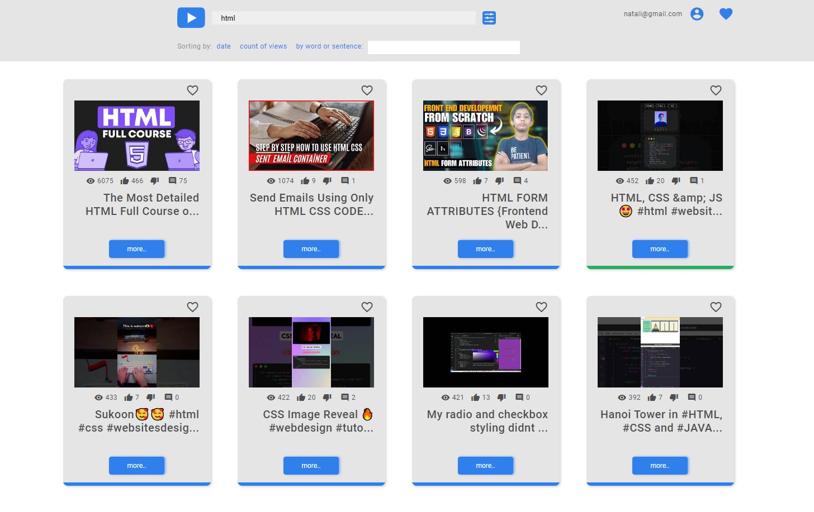

# Youtube App


This is a single-page application (SPA) developed as part of the RS School Angular course in 2024. The project demonstrates working with asynchronous operations in Angular, with a focus on using the YouTube API.



## Демо

Check out [app demo](https://nuttik.github.io/youtube-search/youtube-app/).

Use any email and password for to log in.

## Features

- Search for YouTube videos by keyword and display the results in real-time.
- Save links to your favorite videos for easy access.
- View saved favorite videos on a separate page.

## Technologies

- **Angular 18**: The main framework for building the SPA.
- **YouTube API**: Used to fetch video data asynchronously.
- **Jest**: For writing and running unit tests.
- **TypeScript**: For building strong-typed and maintainable code.
- **HTML/CSS**: For the UI structure and styling.

## Purpose

The primary goal of this project was to gain hands-on experience with asynchronous operations and API integration in Angular. Using the YouTube API serves as a practical example of fetching and handling dynamic data.

## Installation and Setup

1. Clone the repository.

```bash
git clone <repository-url>
```

2. Install dependencies.

```
  npm install
```

3.  Development server

```
 ng serve
```

Navigate to `http://localhost:4200/`. The application will automatically reload if you change any of the source files.

4. Build

```
  ng build
```

5. To run unit tests using Jest:

```
  ng test
```

6. Further help

To get more help on the Angular CLI use `ng help` or go check out the [Angular CLI Overview and Command Reference](https://angular.dev/tools/cli) page.
